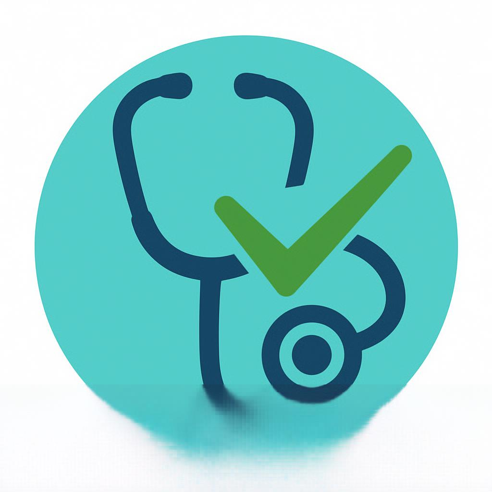

# 🏥 AI-Powered Disease Predictor Web App

<div align="center">
  
</div>

## 🚀 Overview

Welcome to the **AI-Powered Symptom-Based Disease Predictor** – your intelligent healthcare assistant that predicts potential diseases based on symptoms you provide!

This app utilizes advanced **Machine Learning** (Support Vector Classifier) and a rich medical recommendation engine to empower users with actionable health guidance.

> ⚠️ **Note:** This application is for educational and informational purposes only, not a substitute for professional medical advice.
>
> It have to improve a lot we need train this model in Large amount of data to make it work for real

---

## 🧠 Features

- **💡 Disease Prediction**
  - Predicts disease leveraging a trained SVC ML model.
  - Accepts comma-separated symptoms.
  - Flags unrecognized symptoms with a friendly message.

- **📋 Full Medical Info for Each Disease**
  - 📝 **Description:** Short medical explanation.
  - 🛡️ **Precautions:** Preventive measures.
  - 💊 **Medications:** Common drugs.
  - 🍏 **Diet:** Nutrition recommendations.
  - 🏋️ **Workouts:** Suggested exercises.

- **🎤 Smart Input Handling**
  - Normalizes input (spaces, hyphens, case, punctuation).
  - Speech-to-Text via browser technology.

- **✨ Modern Web UI**
  - Built using Flask, Jinja, HTML, Bootstrap.
  - Multiple pages: Home, About, Contact, Developer, Blog.

---

## 📂 Project Structure

```
├── main.py
├── Model/
│   └── svc.pkl
├── Data/
│   ├── symptoms_df.csv
│   ├── precautions_df.csv
│   ├── workout_df.csv
│   ├── description.csv
│   ├── medications.csv
│   └── diets.csv
├── templates/
│   ├── index.html
│   ├── about.html
│   ├── contact.html
│   ├── developer.html
│   └── blog.html
└── static/
    └── img.png
```

---

## ⚙️ Technologies Used

| Category            | Tools                   |
|---------------------|------------------------|
| Backend             | Flask                  |
| Frontend            | HTML, CSS, Bootstrap   |
| Machine Learning    | Scikit-Learn (SVC)     |
| Data Handling       | Pandas, NumPy          |
| Speech Recognition  | `webkitSpeechRecognition()` |

---

## 🛠 Installation & Setup

1. **Clone the Repository**
   ```bash
   git clone https://github.com/yourusername/medical-disease-predictor.git
   cd medical-disease-predictor
   ```

2. **Install Dependencies**
   ```bash
   pip install flask pandas numpy scikit-learn
   ```

3. **Setup Model & Data Files**
   - Place `svc.pkl` in the `Model/` directory.
   - Place all CSV files in the `Data/` directory.

4. **Run the App**
   ```bash
   python main.py
   ```
   App will be live at: [http://127.0.0.1:5000/](http://127.0.0.1:5000/)

---

## 🔍 How the Prediction Works

- **Input:** User enters symptoms (e.g., _itching, headache, nausea_)
- **Normalization:** Symptoms are lowercased, sanitized, mapped.
- **Feature Vector:** 122-dimensional vector is constructed.
- **Prediction:** SVC ML model outputs disease index.
- **Response:** Disease info, description, precautions, medications, diet, workouts.

---

## 📸 Screenshots

| Main Page | Prediction Result |
|---|---|
|  |  |

| Description | Precaution | Medications | Workouts | Diets |
|---|---|---|---|---|
|  |  |  |  |  |

---

## 👨‍💻 Developer

**Sumit Kumar**  
_AI & ML Engineering Student • Passionate about healthcare AI & impactful tech_

- **Email:** [sumitrajkumar2003@gmail.com](mailto:sumitrajkumar2003@gmail.com)
- **Location:** Bhubaneswar, Odisha, India

---

## 📜 License

Distributed under the **MIT License**.

---

## ⭐ Special Notes
- This project is an **educational demo** in machine learning for healthcare.
- Not intended to replace medical professionals.
- **Always consult a doctor for real medical concerns!**

---

<div align="center">
  <strong>
    If you find this project useful, please ⭐ star this repo and share with others!
  </strong>
</div>
